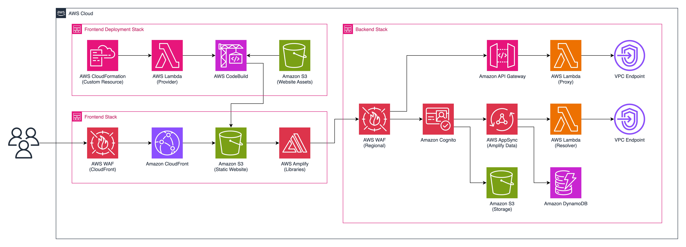
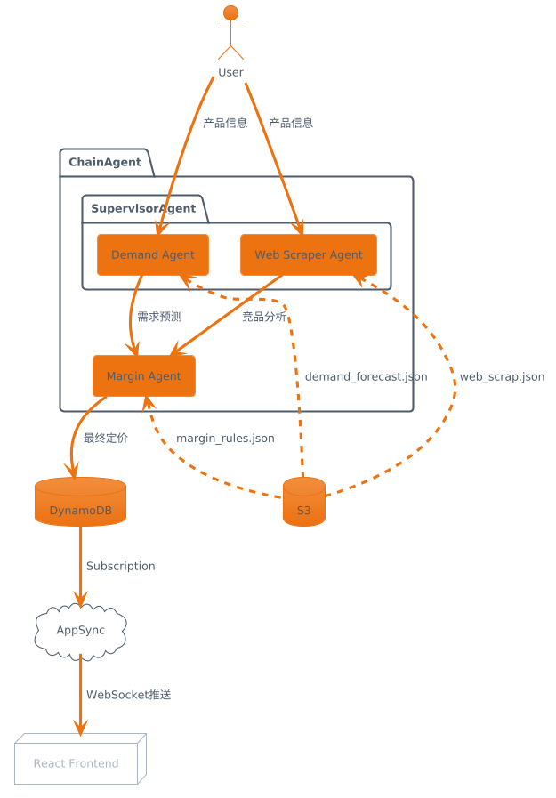

# Retail Pricing Agent Orchestrator

> 基于 Amazon Bedrock 的多智能体零售定价系统

[](LICENSE)
[](https://aws.amazon.com/bedrock/)
[](https://aws.amazon.com/cdk/)

## 🎯 项目概述

这是一个企业级 AI 定价决策系统，通过协调多个专业 AI Agent 实现自动化产品定价：

- **Demand Forecast Agent** - 分析历史数据预测市场需求
- **Web Scraper Agent** - 监控竞品价格进行竞争分析  
- **Margin Agent** - 确保利润目标和 MAP 合规
- **Supervisor Agent** - 协调各 Agent 生成最终定价建议

将传统数天的人工定价分析压缩到分钟级自动化决策。

## 🏗️ 架构



### 技术栈

| 层级 | 技术选型 |
|------|----------|
| 前端 | React 18 + CloudScape + Amplify |
| API | AppSync GraphQL + API Gateway |
| 计算 | Lambda Python + [multi-agent-orchestrator](https://github.com/awslabs/multi-agent-orchestrator) |
| AI | Amazon Bedrock (Claude 3.5 Sonnet) |
| 数据 | DynamoDB + S3 |
| 安全 | Cognito + WAF + VPC |
| IaC | AWS CDK TypeScript |

### 核心设计

```
用户请求 → Supervisor Agent → [Demand Agent ∥ Web Scraper Agent] → Margin Agent → 定价结果
                                        ↓
                              实时 WebSocket 推送到前端
```


## 🚀 快速开始

### 前置条件

- Node.js 22.x
- Python 3.12
- Docker
- AWS CLI (已配置凭证)
- AWS CDK CLI

### 安装部署

```bash
# 克隆仓库
git clone https://github.com/YOUR_USERNAME/retail-pricing-agent.git
cd retail-pricing-agent

# 安装依赖
npm run setup

# 部署到 AWS
npm run -w backend cdk deploy -- --all
```

### 启用 Bedrock 模型

部署前需在 AWS Console 中启用 Bedrock 模型访问：
1. 进入 Amazon Bedrock 控制台
2. 选择 "Model access"
3. 启用 Claude 3.5 Sonnet 和 Nova Pro

## 📁 项目结构

```
├── src/
│   ├── backend/           # CDK 基础设施代码
│   │   └── lib/
│   │       └── stacks/
│   │           └── backend/
│   │               ├── graph-api/        # AppSync + Lambda Agent
│   │               │   └── resolver-function/
│   │               │       ├── agent_orchestrator.py  # 多Agent编排
│   │               │       └── prompts.py             # Agent提示词
│   │               ├── storage/          # S3 数据存储
│   │               └── vpc.ts            # 网络配置
│   └── frontend/          # React 前端应用
│       └── src/
│           ├── components/pricing/  # 定价可视化组件
│           └── pages/               # 页面路由
└── docs/                  # 文档和架构图
```

## 🔧 本地开发

```bash
# 启动前端开发服务器
npm run develop

# 访问 http://localhost:3000
```

## 🧹 清理资源

```bash
# 删除所有 CloudFormation 栈
npm run -w backend cdk destroy -- --all
```

## ❓ 常见问题

### 为什么使用 multi-agent-orchestrator 而不是 Strands Agents SDK？

| 特性 | multi-agent-orchestrator | Strands Agents SDK |
|------|--------------------------|-------------------|
| 定位 | 多Agent协调编排 | 通用Agent开发框架 |
| 核心能力 | Supervisor、Chain、Classifier路由 | Tool调用、多模型支持 |
| LLM支持 | 主要 Amazon Bedrock | Bedrock/OpenAI/Anthropic/Gemini |
| 编排模式 | 内置 SupervisorAgent、ChainAgent | 需自行实现 |

本项目选择 multi-agent-orchestrator 是因为它原生支持 Supervisor 和 Chain 编排模式，正好匹配多Agent协作定价的业务场景。

更多问题请参考 [FAQ.md](./FAQ.md)

## 后续开发计划

我们计划开发基于 Strands Agents SDK 的版本：
- [ ] 支持多模型提供商切换（OpenAI、Anthropic、Gemini）
- [ ] 统一的 Tool 定义接口
- [ ] 本地开发调试支持

## 📄 License

[Apache License 2.0](LICENSE)
